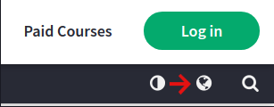
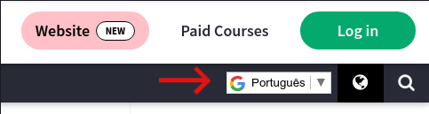
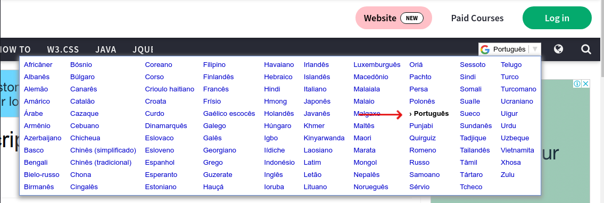

# Lógica de Programação
"Eu acho que todas as pessoas neste país deveriam aprender como programar um computador porque isto te ensina como pensar."
Steve Jobs – Inventor

Lógica de Programação é a forma como nós, Pessoas Desenvolvedoras, pensamos e escrevemos algoritmos para resoluções de problemas ou execuções de tarefas processadas por uma máquina.

Nesse [artigo](https://blog.betrybe.com/tecnologia/logica-de-programacao/) de nosso blog, você poderá ler mais acerca da importância da Lógica de Programação e como aprendê-la.

# Desafios
Este repositório tem por finalidade apresentar alguns exercícios de Lógica de Programação e materiais de estudo complementares sobre os temas que são abordados.

Você verá que alguns links estão em inglês, mas disponibilizamos no final da página um tutorial para te ajudar a traduzir os sites.

Dentro da pasta raiz do projeto, temos a pasta "tests". Ela contém os testes unitários correspondentes a cada bloco de desafios, por exemplo: os testes unitários do bloco Arrays estão no arquivo "arrays.test.js.", do bloco Desafiadores estão no "desafiadores.test.js.".

Para executar os testes de todos os blocos, abra o terminal dentro da pasta raiz do projeto e execute o comando: ```"npm install"``` para instalar as dependências do projeto.

Em seguida execute o comando para rodar todos os testes: ```"npm test"```.

Caso você queira executar apenas um bloco específico, basta após o comando ```"npm test"``` escrever o nome do arquivo da pasta "test" que deseja executar, por exemplo: se deseja verificar apenas os testes do bloco de Strings, então vá até o terminal e execute o comando: ```"npm test strings.test.js"```.

Atenção, nos exercícios, não troque os nomes das funções ou as retire do module.exports.

Confira abaixo os links para estudo:
## Gerais
* [Blog Trybe](https://blog.betrybe.com/javascript/)
* [Laços e iterações MDN](https://developer.mozilla.org/pt-BR/docs/Web/JavaScript/Guide/Loops_and_iteration)

### Operadores
* [Operadores de comparação MDN](https://developer.mozilla.org/pt-BR/docs/Web/JavaScript/Guide/Expressions_and_operators)
* [Operadores de comparação W3](https://www.w3schools.com/js/js_comparisons.asp)

### Métodos de Strings
* [String MDN](https://developer.mozilla.org/pt-BR/docs/Web/JavaScript/Reference/Global_Objects/String)
* [Métodos úteis de string MDN](https://developer.mozilla.org/pt-BR/docs/Learn/JavaScript/First_steps/Useful_string_methods)
* [JavaScript String Methods W3](https://www.w3schools.com/js/js_string_methods.asp)
* [JavaScript String Search W3](https://www.w3schools.com/js/js_string_search.asp)

### Método de números
* [Números MDN](https://developer.mozilla.org/pt-BR/docs/Web/JavaScript/Reference/Global_Objects/Number)
* [Math MDN](https://developer.mozilla.org/pt-BR/docs/Web/JavaScript/Reference/Global_Objects/Math)
* [JavaScript Number Methods W3](https://www.w3schools.com/js/js_number_methods.asp)
* [JavaScript Math Reference W3](https://www.w3schools.com/jsref/jsref_obj_math.asp)
* [JavaScript Math Object W3](https://www.w3schools.com/js/js_math.asp)

### Laços de repetição

#### For
* [For MDN](https://developer.mozilla.org/pt-BR/docs/Web/JavaScript/Reference/Statements/for)
* [For...in MDN](https://developer.mozilla.org/pt-BR/docs/Web/JavaScript/Reference/Statements/for...in)
* [For...of](https://developer.mozilla.org/pt-BR/docs/Web/JavaScript/Reference/Statements/for...of)
* [JavaScript For Loop W3](https://www.w3schools.com/js/js_loop_for.asp)
* [JavaScript For In W3](https://www.w3schools.com/js/js_loop_forin.asp)
* [JavaScript For Of W3](https://www.w3schools.com/js/js_loop_forof.asp)

#### While
* [While MDN](https://developer.mozilla.org/pt-BR/docs/Web/JavaScript/Reference/Statements/while)
* [JavaScript While Loop W3](https://www.w3schools.com/js/js_loop_while.asp)

### Condicionais
* [Operador Condicional Ternário MDN](https://developer.mozilla.org/pt-BR/docs/Web/JavaScript/Reference/Operators/Conditional_Operator)
* [Tomando decisões no seu código — condicionais MDN](https://developer.mozilla.org/pt-BR/docs/Learn/JavaScript/Building_blocks/conditionals)

#### Switch
* [Switch MDN](https://developer.mozilla.org/pt-BR/docs/Web/JavaScript/Reference/Statements/switch)
* [JavaScript Switch Statement W3](https://www.w3schools.com/js/js_switch.asp)

#### If/else
* [If...else MDN](https://developer.mozilla.org/pt-BR/docs/Web/JavaScript/Reference/Statements/if...else)
* [JavaScript if else and else if W3](https://www.w3schools.com/js/js_if_else.asp)
* [JavaScript if/else Statement W3](https://www.w3schools.com/jsref/jsref_if.asp)


### Tutorial de como traduzir o W3 schools

Quando o site for aberto, ao lado direito superior vai ter um “botão” com o formato do planeta :
<br>


Clicando nele uma barra de busca vai ser aberta, onde devemos escolher em qual idionma queremos ver o site:
<br>


Agora é só escolher o idioma:
<br>

